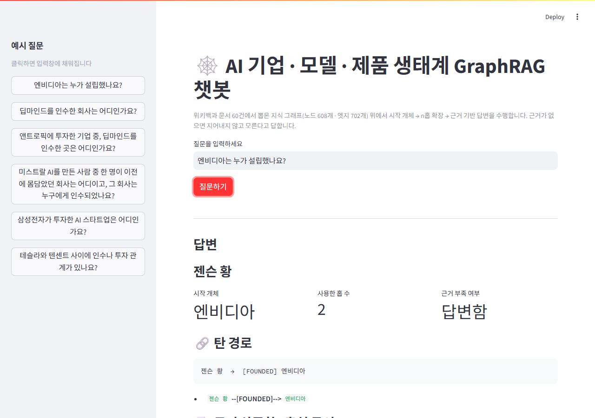
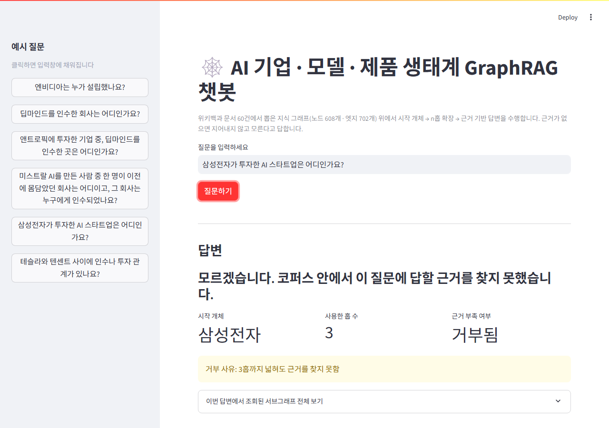

# AI 기업 · 모델 · 제품 생태계 GraphRAG 챗봇

한국어 위키백과 문서 60건에서 지식 그래프를 뽑아, 질문마다 시작 개체를 찾고 n홉까지
확장한 뒤 **근거로 조회된 사실만으로** 답하고 경로·근거를 함께 보여주는 GraphRAG 에이전트입니다.
근거가 없으면 지어내지 않고 "모른다"고 답합니다.

```
문서 60건 → ① 추출 → ② 정제·병합 → 지식 그래프(노드 608 · 엣지 702)
                                          ↓
    질문 → ③ 시작 개체 찾기 → ④ n홉 확장 → ⑤ 근거만으로 답변 + 경로 제시
                                  ↓
                끊기면 넓히고(2홉→3홉), 그래도 없으면 모른다고 말하기
```

## 🌐 라이브 데모

**[여기서 바로 써보기 →](https://ai-ecosystem-graphrag-5lpdgjw99e3pm2dyb9be36.streamlit.app/)**

방문자 각자의 OpenAI API 키로 동작합니다. 화면 왼쪽에 본인의 키(`sk-...`)를 입력해야
질문할 수 있고, 키는 서버에 저장되지 않으며 탭을 닫으면 그 세션의 키는 사라집니다.
API 요금은 입력한 키의 소유자에게 청구되니, 사용 전 [OpenAI 대시보드](https://platform.openai.com/account/limits)에서
지출 한도를 걸어두는 걸 권장합니다.

> Streamlit Community Cloud 무료 플랜은 한동안 방문이 없으면 앱을 재운다. 오랜만에 열면
> 몇 초~몇십 초간 "waking up" 화면이 뜰 수 있으니 잠시 기다리면 된다.

### 직접 배포하기 (Streamlit Community Cloud, 무료)

1. [share.streamlit.io](https://share.streamlit.io)에서 GitHub 계정으로 로그인
2. "New app" → 이 저장소(`ai-ecosystem-graphrag`) 선택 → main file을 `app.py`로 지정 → Deploy
3. API 키는 여기서 입력하지 않습니다 — 방문자가 화면에서 직접 입력하는 구조라 Secrets 설정이 필요 없습니다.
4. 배포되면 나온 URL을 위 "라이브 데모" 링크 자리에 채워 넣으면 됩니다.

## 로컬 환경 준비

```bash
python -m venv .venv
.venv\Scripts\activate        # Windows
pip install -r requirements.txt
```

`app.py`(데모)는 화면에서 API 키를 입력받으므로 별도 설정이 필요 없습니다.
반면 `collect_corpus.py` / `build_graph.py` / `evaluate.py` / `agent.py`를 커맨드라인으로
직접 실행할 때는 환경변수 `OPENAI_API_KEY`가 필요합니다. 이 프로젝트는 로컬 개발 편의를 위해
`keys.env`를 별도 경로에서 읽도록 되어 있습니다(레포에 키를 커밋하지 않기 위함) — 각 파일
상단의 `load_dotenv(...)` 경로를 자신의 키 파일 경로로 바꾸거나, 그냥 환경변수
`OPENAI_API_KEY`를 직접 설정해도 됩니다(파일이 없으면 조용히 건너뜁니다).

## 실행 순서 (파이프라인 전체)

```bash
# 1. 코퍼스 수집 (위키백과 API, 시드 28개 → 2홉 확장 → 60건)
python scripts/collect_corpus.py

# 2. 그래프 추출 + 정규화 (LLM 스키마 추출 → 별칭 병합 → graph.graphml)
python build_graph.py

# 3. 에이전트 단독 실행 (커맨드라인에서 질문 하나 테스트)
python agent.py "엔비디아는 누가 설립했나요?"

# 4. 평가 (골든셋 14문항 채점 + basic RAG 대조)
python evaluate.py

# 5. 웹 데모
streamlit run app.py
```

각 단계 산출물은 `output/`, `data/`에 남고, `build_graph.py`는 캐시(`output/triples_raw.json`)가
있으면 API를 다시 호출하지 않습니다.

## 데모 화면




왼쪽 사이드바에 본인의 OpenAI API 키를 넣고, 예시 질문을 클릭하면 입력창에 채워집니다.
"질문하기"를 누르면:
- **답변**: 근거로 조회된 삼중항만으로 만든 답
- **시작 개체 / 사용한 홉 수 / 근거 부족 여부**: 탐색이 어떻게 이뤄졌는지 요약
- **탄 경로**: 실제로 탄 관계 사슬 (개체 --[관계]--> 개체)
- **근거 삼중항 · 출처 문서**: 답을 뒷받침하는 원문 문장과 문서명

## 프로젝트 구조

```
ai-ecosystem-graphrag/
├── data/
│   ├── docs/            # 위키백과 원본 문서 60건
│   ├── manifest.json    # 코퍼스 채택/탈락 기준과 건수
│   └── goldenset.json   # 평가셋 14문항 (기대 정답·경로·근거)
├── config.json           # 스키마(노드·관계) · 추출 파라미터 · 정규화 별칭 · 탐색 반경/상한
├── scripts/collect_corpus.py
├── build_graph.py         # 추출 + 정제
├── agent.py                # 시작 개체 → n홉 확장 → 답변 (LangGraph, 경로 기록)
├── evaluate.py              # 홉 수별 채점 + basic RAG 대조
├── app.py                    # Streamlit 데모
└── output/
    ├── graph.graphml
    ├── triples_normalized.json
    ├── runs.jsonl        # agent.py가 답한 모든 질문 로그
    └── eval_results.json
```

## 참고: 데이터 출처

`scripts/collect_corpus.py`가 한국어 위키백과 MediaWiki API로 수집합니다. 채택/탈락 기준은
`data/manifest.json`에 남아 있습니다 (연도/목록/동음이의 문서 제외, 위키백과 관리용 분류는
개체 겹침 판단에서 제외, 본문 800자 미만 토막글 제외).
