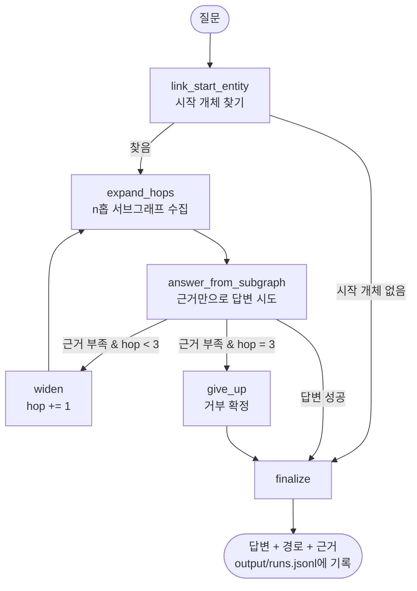

# REPORT — AI 기업 · 모델 · 제품 생태계 GraphRAG 에이전트

- **GitHub**: [inseoklee-ai/ai-ecosystem-graphrag](https://github.com/inseoklee-ai/ai-ecosystem-graphrag)
- **라이브 데모**: [ai-ecosystem-graphrag-5lpdgjw99e3pm2dyb9be36.streamlit.app](https://ai-ecosystem-graphrag-5lpdgjw99e3pm2dyb9be36.streamlit.app/) (방문자 각자의 OpenAI API 키로 동작. 자세한 내용은 5장)

## 1. 주제와 코퍼스

### 주제를 고른 이유

지난주 과제(한국어 위키백과 한국영화 80건으로 만든 GraphRAG)와 다른 주제가 필요했다.
처음에는 "내 프로젝트 히스토리"(HANDOFF.md·README.md 등 이미 갖고 있던 여러 프로젝트 문서)를
후보로 잡았지만, 필수 요구사항인 "개체가 문서 사이에 겹치는 코퍼스 50건 이상"을 채우기엔
실제 문서가 10건이 채 안 됐다. 문서를 억지로 잘게 쪼개면 이번엔 문서당 정보량이 너무
빈약해져 추출 품질이 떨어지는 역효과가 났을 것이다.

대신 **AI 기업 · 모델 · 제품 생태계**를 택했다. 위키백과 문서량과 상호 링크가 모두
풍부해서 지난주와 같은 "위키 시드 → 링크 확장" 방식을 그대로 재사용할 수 있고, 본인이
평소 다루는 AI 에이전트 개발 주제와도 맞닿아 있었다.

### 코퍼스 수집

`scripts/collect_corpus.py`가 한국어 위키백과 MediaWiki API로 수집한다.

1. 회사(OpenAI·구글·마이크로소프트 등) · 인물(젠슨 황·일론 머스크 등) · 모델(GPT-4·챗GPT 등)을
   섞은 시드 28개에서 출발
2. 시드 문서의 본문 링크(`prop=links`) 중 **여러 시드가 함께 가리키는 것**을 2홉 후보로 우선
3. 그 후보 중 시드와 **분류(category)를 공유**하는 것만 남김 — 단, 위키백과 관리용 분류
   ("출처가 필요한 문서" 등 거의 모든 문서에 붙는 분류)는 개체 겹침 신호로 치지 않도록 제외
4. 연도·목록·동음이의 문서 제외, 본문 800자 미만 토막글 제외

| 단계 | 건수 |
|---|---|
| 2홉 후보(중복 제거) | 4,161건 |
| 제목 패턴 제외(연도/목록/동음이의) | 70건 |
| 분류 불일치로 제외 | 2,882건 |
| 토막글(800자 미만) 제외 | 12건 |
| **최종 채택** | **60건** |

시드 28개 중 "Cohere"만 위키백과 문서를 찾지 못해 빠졌다. 채택/탈락 상세 목록은
[data/manifest.json](data/manifest.json)에 그대로 남아 있다.

**시행착오**: 처음 돌렸을 때는 분류 필터가 관리용 분류까지 겹침으로 인정해버려 "미국",
"영어", "포브스", "웨이백 머신" 같은 주제와 무관한 문서 7건이 섞여 들어왔다. 필터를
고쳐 재실행하니 노이즈가 2건으로 줄고, 그 자리를 "제미니", "구글 바드", "Stability AI"
같은 진짜 AI 생태계 문서가 채웠다.

## 2. 골든셋과 스키마

### 스키마

노드 4종(Company·Person·Model·Product), 관계 11종(FOUNDED·WORKED_AT·LEADS·DEVELOPED·
RELEASED·BUILT_ON·ACQUIRED·INVESTED_IN·PARTNERED_WITH·PARENT_OF·RUNS_ON)으로 제한했다.
전체 정의는 [config.json](config.json)의 `schema` 항목에 있다.

**뽑지 않기로 한 관계와 그 대가**
- **시점 정보(언제부터/까지)를 넣지 않았다.** 그 대가를 골든셋 q12에서 직접 겪었다:
  "일리야 수츠케버가 공동 설립한 오픈AI를 현재 이끄는 사람은?"에 대해 그래프에는
  `미라 무라티 LEADS 오픈AI`(3일간의 임시 대표)와 `샘 올트먼 LEADS 오픈AI`가 시점 구분
  없이 나란히 존재해서, 답변 단계 LLM이 실행마다 다른 사람을 고르는 걸 확인했다.
  LEADS에 `since`/`until` 같은 속성을 더했다면 막을 수 있었을 문제다.
- **일반적인 "RELATED_TO" 같은 포괄 관계를 넣지 않았다.** 스키마를 좁게 유지해 그래프가
  잡음 없는 구조를 갖게 하려는 의도였지만, 그 대가로 "만든 사람 중 한 명이 재직했던 회사"처럼
  좁은 관계 사슬로만 답해야 하는 질문에서 대안 경로가 없어 실패하기 쉬웠다(아래 3-홉 실패 참고).
- **인물 간 관계(사제·동료 등)를 넣지 않았다.** 회사·모델·제품 중심 생태계를 보여주는 데
  집중하려는 선택이었고, 이번 골든셋 범위에서는 대가가 드러나지 않았다.

### 같은 개체를 하나로 합치는 기준 (정규화)

`config.json`의 `normalization.alias_map`에 20여 건을 직접 채워 넣었다. 예: 앤트로픽/앤트로픽
PBC, 오픈AI/OpenAI, 제미나이/제미니, 클로드/Claude, 선다 피차이/순다르 피차이, 성만 추출된
"황"/"머스크"/"저커버그". 이 중 상당수는 golden set 검증 중 실제로 그래프가 쪼개져 있는
걸 발견하고 나서야 채운 것들이다 — 자동화된 정규화만으로는 못 잡고, 결과를 직접 눈으로
훑어야 잡히는 문제였다.

### 골든셋 (14문항, [data/goldenset.json](data/goldenset.json))

| 홉 수 | 문항 수 | 비고 |
|---|---|---|
| 1홉 | 6 | FOUNDED·ACQUIRED·INVESTED_IN·BUILT_ON·PARENT_OF·PARTNERED_WITH 각 1회 이상 포함 |
| 2홉 | 4 | 서로 다른 문서 두 개를 다리 노드로 이어야 풀리게 설계 |
| 3홉 | 2 | 세 문서를 연쇄로 결합해야 하는 문항 |
| 거부(근거 없음) | 2 | 시작 개체가 아예 없는 경우 1건 + 개체는 있지만 경로가 없는 경우 1건 |

기대 경로는 실제 코퍼스 문장을 먼저 찾아 인용한 뒤(`evidence` 필드), 그 문장이 스키마의
어떤 관계로 표현되는지 역으로 정했다. 거부 문항 2건은 만들기 전에 grep으로 두 개체 사이에
실제로 연결 문장이 없는지 직접 확인하고 골랐다.

## 3. 측정 결과

### 홉 수별 대조표 (평균으로 뭉개지 않음)

| 유형 | 문항수 | GraphRAG 정확도 | basicRAG(BM25) 정확도 | GraphRAG 경로 재현율 |
|---|---|---|---|---|
| 1홉 | 6 | **100%** | 17% | 1.00 |
| 2홉 | 4 | **75%** | 25% | 0.75 |
| 3홉 | 2 | 0% | 0% | 0.17 |
| 거부(근거없음) | 2 | 100% | 100% | - |

basicRAG는 BM25로 상위 5개 문서만 주고 그 안에서만 답하게 한 베이스라인이다
([evaluate.py](evaluate.py)). 1~2홉에서 GraphRAG가 크게 앞서는 것은 지난주 한국영화
프로젝트와 같은 패턴이다 — 질문의 답이 시작 문서가 아니라 "그 문서와 연결된 다른 문서"에
있을 때 BM25는 애초에 그 문서를 상위 5개 안에 불러오지 못한다. 3홉은 둘 다 0%로, 이번
그래프·에이전트 조합의 진짜 한계가 어디인지 정직하게 드러났다.

전체 결과는 [output/eval_results.json](output/eval_results.json)에, 에이전트가 실제로
답한 모든 질문(경로·근거 포함)은 [output/runs.jsonl](output/runs.jsonl)에 남아 있다.

### 실패 사례를 직접 읽고 층별로 분류

| 문항 | 무엇을 물었나 | 어디서 깨졌나 | 근거 |
|---|---|---|---|
| q08 | 챗GPT를 구동하는 GPU 회사의 설립자는? | **색인(추출)** | 원문에 "3만 대의 엔비디아 GPU로 구동"이라고 명시돼 있는데도 RUNS_ON 관계로 추출되지 않음. 그래프 전체에 RUNS_ON 엣지가 4개뿐일 정도로 이 관계 자체가 드물게 뽑힘 |
| q11 | 미스트랄 AI 공동창립자 중 한 명이 이전에 몸담았던 회사와 그 회사의 인수자는? | **생성(답변)** | 필요한 근거 3개(멘쉬-FOUNDED-미스트랄AI, 멘쉬-WORKED_AT-구글딥마인드, 구글-ACQUIRED-구글딥마인드) 모두 서브그래프에 있었다. 그런데 공동창립자가 3명이라 후보가 갈리는 상황에서, 모델이 첫 후보(라크루아→메타 플랫폼스)를 시도했다가 막히자 다른 후보(멘쉬→구글 딥마인드)를 마저 확인하지 않고 포기했다. `AnswerResult`에 `reasoning` 필드를 넣어 직접 추적해 확인한 것이다 |
| q12 | 일리야 수츠케버가 세운 오픈AI의 현 대표와 그가 설립 당시 몸담았던 조직은? | **색인(추출)** | "샘 올트먼: 와이 콤비네이터의 사장"이라는 짧은 목록형 문장이 관계로 추출된 적이 한 번도 없었다. 수츠케버의 FOUNDED 관계도 추출을 다시 돌릴 때마다 WORKED_AT/LEADS로 흔들렸다 |

**탐색(그래프 순회) 단계에서 깨진 사례는 없었다** — n홉 확장과 허브 상한 로직 자체는
데이터가 뒷받침되기만 하면 정확하게 동작했다. 반대로 색인 2건, 생성 1건은 각각 "짧고
간접적인 문장에서의 관계 추출 recall"과 "다중 후보 중 하나가 막히면 포기하는 경향"이라는,
스키마나 탐색 로직이 아니라 LLM 자체의 한계로 좁혀졌다.

## 4. 파이프라인 구조도 (LangGraph)

State는 `question · start_entities · hop_used · subgraph_triples · answerable · answer ·
path_used · evidence_used · refused · refusal_reason` 필드로 구성된다
([agent.py](agent.py)의 `AgentState`). 허브(차수>20, 608개 중 10개) 노드는 시작점·도착점으로는
자유롭게 쓰지만, 그 노드에서 다음 홉으로 더 뻗어나갈 때만 근거 많은 순 15개로 제한한다 —
완전히 막으면 구글·마이크로소프트·오픈AI처럼 실제 정답이 반드시 거쳐 가는 다리 노드까지
끊겨버려서, "차단"이 아니라 "상한"으로 설계했다.

## 5. 데모 설계

[app.py](app.py)는 Streamlit으로 만들었다. 신경 쓴 부분:

- **예시 질문 클릭식 입력**: 골든셋 6문항을 사이드바 버튼으로 두어, 스키마나 코퍼스를
  모르는 사람도 바로 눌러볼 수 있게 했다.
- **답변 아래 "시작 개체 · 사용한 홉 수 · 근거 부족 여부"를 항상 노출**: 에이전트가
  실제로 몇 홉까지 넓혔는지, 거부했는지를 답변 문장만으로는 알 수 없어서 메트릭으로 따로 뺐다.
- **"탄 경로"를 화살표 체인과 개별 엣지 목록 둘 다로 보여줌**: 한눈에 흐름을 보고 싶은
  사람과 각 관계를 하나씩 확인하고 싶은 사람 모두를 고려했다.
- **근거 삼중항마다 출처 문서명 + 원문 인용을 카드로 분리**: 답변이 실제로 어느 문서의
  어느 문장에서 나왔는지 클릭 없이 바로 확인할 수 있게 했다.
- **조회된 서브그래프 전체를 접이식으로 노출**: 최종 답변에 안 쓰인 나머지 근거도 투명하게
  볼 수 있게 남겨뒀다(검증·디버깅용).
- **API 키를 방문자가 직접 입력하게 함(BYOK)**: 처음엔 Streamlit Cloud에 공개 배포해 링크로
  피어리뷰를 받으려 했는데, 공용 키를 서버에 심으면 링크를 아는 누구나 내 API 비용을
  소모시킬 수 있다는 문제가 있었다. `agent.py`의 OpenAI 클라이언트를 모듈 임포트 시점에
  고정하지 않고 `set_api_key()`로 나중에 주입할 수 있게 바꿔서, 방문자가 화면에 자기 키를
  넣어야만 질문할 수 있게 했다 — 키는 세션 메모리에서만 쓰이고 저장되지 않는다.

거부 사례(예: "삼성전자가 투자한 AI 스타트업은?")도 같은 화면에서 "거부됨" 배지와 거부
사유를 그대로 보여준다.

| 정상 답변 | 거부 사례 |
|---|---|
|  |  |

## 6. 프로젝트 회고

**가장 공들인 부분**: 겉으로 잘 동작하는 것처럼 보이는 파이프라인 각 단계를 실제로
의심하고 검증한 것. 코퍼스 수집 필터의 숨은 버그(관리용 분류 오염), 그래프의 표기 분열
(앤트로픽/앤트로픽 PBC 등 20여 건), 에이전트의 실제 코드 버그 3개(허브 상한이 시작
개체에도 걸리던 문제, 복합 고유명사 오분할, 짧은 단어의 잘못된 부분일치)를 모두 "일단
돌아가니 넘어가기"가 아니라 골든셋으로 하나씩 대조하며 잡았다. 특히 근거가 그래프에
다 있는데도 답을 못 내는 경우(q11)를 코드 버그가 아니라 모델의 다중 후보 탐색 한계로
정확히 좁힌 것 — `AnswerResult`에 `reasoning` 필드를 추가해 모델의 실제 사고 과정을
들여다본 것 — 이 가장 값진 작업이었다.

Streamlit Cloud에 실제로 배포할 때도 비슷한 일이 있었다. `requirements.txt` 설치가
"Error installing requirements"로만 실패해서, 처음엔 사용하지 않던 `langchain-openai`
의존성을 의심해 지웠지만 재발했다. 로그를 끝까지 읽어보니 진짜 원인은 Streamlit Cloud가
Python 3.14를 쓰는데 우리가 고정한 `pydantic-core==2.23.4`가 그 버전용 사전 빌드 파일이
없어 Rust로 소스 빌드를 시도하다 실패한 것이었다(`runtime.txt`로 3.12를 지정해도 반영되지
않았다). 근본 원인을 pydantic 버전 고정 자체로 보고 상한만 두는 방식(`pydantic>=2.9,<3`)으로
바꿔 리졸버가 3.14용 wheel이 있는 최신 버전을 고르게 하고서야 해결됐다 — 겉보기엔 같은
"Error installing requirements"라도 원인은 매번 로그를 끝까지 읽어야 알 수 있었다.

### 홉 수가 늘수록 취약해지는 구조적 이유

3홉 문항 2개가 모두 실패(0%)했는데, 표본이 2개뿐이라 "3홉은 항상 안 된다"는 뜻은 아니다.
다만 실패 원인(q11=생성 단계, q12=색인 단계)을 뜯어보니, 홉 수가 늘수록 이 두 실패 모두
구조적으로 더 자주 일어날 수밖에 없는 이유가 보였다.

1. **추출 recall이 곱으로 줄어든다.** n홉 질문에 답하려면 그 경로를 이루는 엣지 n개가
   전부 그래프에 있어야 한다. 엣지 하나당 추출 recall이 90%라도 3홉이면 기대 성공률은
   0.9³ ≈ 73%로 떨어지고, RUNS_ON처럼 애초에 recall이 낮은 관계(그래프 전체에 4건뿐)가
   경로에 하나라도 끼면 그 문항은 거의 실패로 확정된다. q12가 정확히 이 경우다 — 필요한
   3개 엣지 중 "와이 콤비네이터" 관계 하나가 추출된 적이 없어서 나머지가 다 맞아도
   실패했다.
2. **홉이 늘수록 답변 단계가 봐야 할 후보가 커진다.** q11은 hop=2에서 서브그래프 36개
   엣지였지만 hop=3에서는 80개로 늘었다. 후보가 늘어난다는 것은 정답 경로 하나를 그
   안에서 정확히 짚어내야 하는 부담이 커진다는 뜻이고, 작은 모델(gpt-4o-mini)일수록
   여기서 무너지기 쉽다.
3. **분기(여러 후보)가 있는 조건은 홉마다 곱해진다.** "~한 사람 중 한 명"처럼 후보가
   여럿인 조건이 경로 중간에 하나만 있어도 위험한데, 홉이 늘면 각 단계마다 후보가 여럿일
   가능성 자체가 커진다(창립자 3명 각각의 소속 회사, 그 각각의 인수 이력...). q11에서
   모델이 첫 후보에서 막히자 포기한 것처럼, 후보 조합이 늘어날수록 "일부만 탐색하고
   포기"할 지점도 늘어난다.

즉 3홉 실패는 색인 recall 하락(①)과 답변 단계의 탐색 부담·분기 증가(②③)가 겹쳐서
난 결과이지, 그래프 순회(탐색) 로직 자체의 결함은 아니었다(3장에서 확인했듯 탐색 단계
실패는 0건이었다).

### 해법

1. **관계에 시점 속성 추가**: LEADS·WORKED_AT에 `since`/`until`을 넣으면 q12류의
   시점 모호성 문제를 근본적으로 줄일 수 있다.
2. **희귀·간접 관계의 추출 recall 개선(원인 ① 대응)**: RUNS_ON처럼 몇 안 되는 예시로는
   LLM이 잘 안 뽑는 관계, "이름: 직함" 같은 목록형 문장에서 놓치는 관계에 few-shot 예시를
   프롬프트에 추가한다. 엣지 하나의 recall을 높이는 게 n홉에서는 제곱·세제곱으로 이득이라
   가장 먼저 손댈 곳이다.
3. **경로를 LLM이 자유 서술로 조립하게 두지 않고, 그래프 알고리즘이 먼저 후보 경로를
   전부 나열한다(원인 ②③ 대응)**: 지금은 답변 LLM이 큰 서브그래프를 통째로 보고 체인을
   스스로 찾는데, 홉이 늘수록 이 방식이 흔들린다. 대신 `networkx`의 단순 경로 탐색으로
   "조건을 만족하는 경로 후보"를 결정적으로 다 뽑아 LLM에게 "이 중 골라라"로 넘기면,
   후보를 놓치거나 하나에서 막혀 포기하는 일을 코드 단에서 막을 수 있다.
4. **다중 후보 질문에서의 병렬 탐색(원인 ③의 구체적 구현)**: "~한 사람 중 한 명"류
   질문은 후보별로 그래프 알고리즘이 먼저 각 후보의 도달 가능 여부를 확인해 LLM에게
   "후보 A는 막힘, 후보 B는 조건 만족"처럼 구조화해서 넘긴다. 위 3번과 맞물려서, 분기가
   있는 지점마다 이 필터를 적용하면 홉이 늘어도 후보 폭증을 코드가 대신 감당하게 된다.
5. **골든셋의 3홉 문항을 늘려 재측정**: 지금은 3홉이 2문항뿐이라 0%가 통계적으로 불안정
   하다. 위 개선을 적용한 뒤 3홉 문항을 10개 이상으로 늘려, 이번에 발견한 두 원인이 실제로
   해결됐는지 홉별 표로 다시 확인해야 한다.
6. **전역형 질문 대응**: 이번엔 커뮤니티 요약을 생략했는데, "AI 업계에서 가장 영향력
   있는 인물군은?" 같은 전역 질문에는 결국 필요해질 것이다.

### 실전 함의: 어디에 투자해야 하는가

**배경 — 왜 이 역설이 중요한가.** 멀티홉 그래프RAG의 존재 이유는 "따로따로는 무해해 보이는
사실들이 몇 단계를 거쳐 이어질 때 드러나는 연결"을 찾는 것이다. 1홉짜리 사실은 이미 검색으로
충분하다. 진짜 값어치는 "A가 B에 투자했고, B는 C를 인수했고, C의 전 임원이 D 사건에 연루됐다"
같은, 문서 하나만 봐서는 절대 안 보이는 연결에 있다. 팔란티어의 온톨로지 제품(Gotham·Foundry)이
정보기관·금융범죄수사·의료 데이터 연계 같은 영역에서 쓰이는 이유가 정확히 이것이다 — 그런
영역일수록 숨은 연결 하나를 놓치는 대가가 크다. 그런데 이번 프로젝트가 정량적으로 보여준 것은,
**바로 그 "값어치가 가장 큰 지점"(홉이 깊을수록)이 "가장 무너지기 쉬운 지점"과 정확히 겹친다는
것**이다. 추출 recall은 홉 수만큼 곱으로 줄고, 답변 단계가 봐야 할 후보는 홉마다 기하급수로
늘고, 분기(다중 후보)는 홉마다 곱해진다. 즉 멀티홉 시스템은 가장 쓸모 있어야 할 순간에 가장
믿을 수 없어지는 구조적 역설을 안고 있다.

**핵심 인사이트 — 비용을 "언제" 쓰는지가 다르다.** 이번에 만든 에이전트는 질문이 들어올 때마다
LLM이 서브그래프를 통째로 보고 스스로 경로를 조립한다. 이 구조의 비용은 **쿼리 시점(query-time)**
에 실린다 — 질문 하나당 LLM 호출과 추론이 반복된다. 반면 팔란티어류의 실전 온톨로지 시스템은
비용을 정반대 시점에 싣는다. 대부분의 자원이 **빌드타임/유지보수 시점**에 들어간다:
1. 개체 해상도(entity resolution)를 정밀하게 맞추는 데 — 이번 프로젝트에서 "앤트로픽 /
   앤트로픽 PBC"처럼 같은 개체가 표기만 달라 쪼개진 걸 20여 건 수작업으로 잡았는데, 실전
   시스템은 이 작업을 훨씬 큰 규모·정밀도로, 분석가가 검증하는 워크플로우로 상시 수행한다.
2. 관계 추출의 정밀도를 사람이 검증하는 데 — LLM이 한 번 뽑은 관계를 그대로 믿지 않고,
   사람(analyst)이 확인한 관계만 그래프에 반영한다.
3. 그래프 순회는 결정적 알고리즘으로 값싸게 수행하고, LLM(또는 사람)은 "후보 경로 중 골라서
   설명하는" 역할로 좁힌다.

이번 프로젝트의 실측 데이터가 이 방향이 맞다는 걸 뒷받침한다: 그래프 순회(BFS) 자체는 608개
노드 그래프에서 밀리초 단위로 저비용이었고, 실제 실패는 **추출 단계(색인)**와 **LLM이 탐색까지
겸하는 구조(생성)**에서 났다. 즉 "쿼리 시점에 더 큰 모델을 쓰거나 재시도를 더 태우는 것"(컴퓨팅을
늘리는 것)은 이 문제의 본질적 해법이 아니다. 그래프 자체의 정밀도(추출 recall, 개체 해상도)를
높이고, LLM의 역할을 "탐색"에서 "선택·설명"으로 좁히는 구조 변경이 훨씬 레버리지가 크다.

**팀에게 주는 전략적 함의.** AI 에이전트를 배우는 입장에서 이건 "어디에 투자할지"를 가르는
질문이다. "더 큰/똑똑한 모델을 쓴다"는 선택은 매력적이지만, 이번처럼 멀티홉에서 정확도가
무너지는 원인의 대부분은 모델의 원초적 추론 능력보다 (a) 데이터 정합성(추출 recall, 엔티티
정규화)과 (b) 아키텍처(LLM에게 탐색까지 맡기는가, 탐색은 알고리즘에 맡기고 LLM은 선택·설명만
하게 하는가)에서 왔다. 특히 사람의 생활에 직접 영향을 주는 도메인(의료·금융·안전·사법)일수록,
투자 비중은 "쿼리 시점 모델 성능"보다 "빌드타임 데이터 품질과 사람 검증 워크플로우" 쪽으로
기울어야 한다 — 이는 "에이전트가 알아서 잘 찾아줄 것"이라는 기대와는 정반대 방향이다. 실무적으로
이번 프로젝트에서도, 코퍼스 필터의 버그 하나(노이즈 7건)와 표기 분열 20여 건을 잡는 데 들인
시간이 에이전트 코드를 고치는 시간보다 최종 정확도에 더 크게 기여했다 — "AI 에이전트 프로젝트의
진짜 레버리지가 어디 있는가"에 대한, 추상적 주장이 아니라 이번에 직접 확인한 데이터다.
